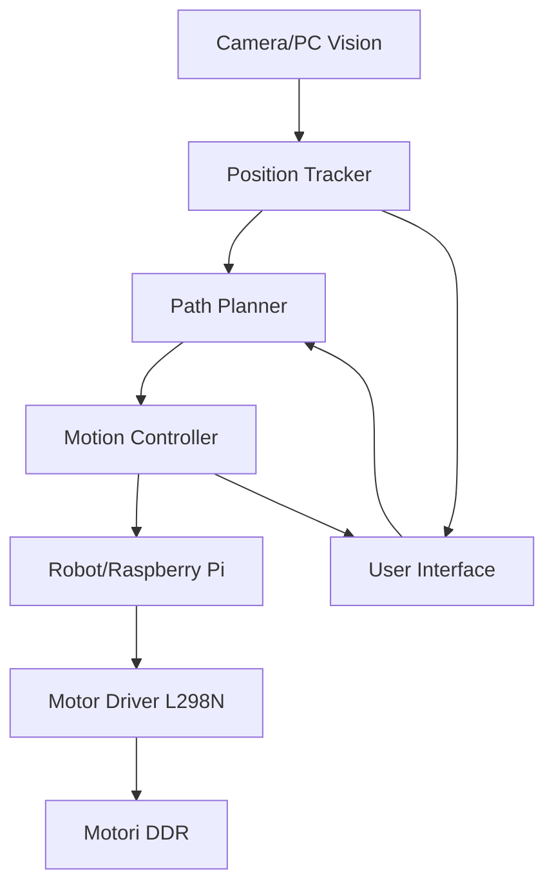

# Sistema di Controllo Robotico con Feedback Visivo
## Analisi dei Requisiti e Progettazione Tecnica

**Progetto:** DDR Robot - Differential Drive Robot  
**Data:** 31 Agosto 2025  
**Versione:** 1.0  

---

## 1. ANALISI DEI REQUISITI

### 1.1 Obiettivo Principale
Sviluppare un sistema di controllo in tempo reale per un differential drive robot che utilizza il feedback della telecamera per correggere automaticamente la traiettoria e raggiungere posizioni target nell'arena.

### 1.2 Requisiti Funzionali

#### RF1 - Localizzazione Robot
- **RF1.1** Il sistema deve rilevare la posizione (x, y) del robot nell'arena con coordinate normalizzate 0-100
- **RF1.2** Il sistema deve calcolare l'orientamento θ (theta) del robot in gradi 0-360°
- **RF1.3** La frequenza di aggiornamento deve essere ≥ 10 Hz per controllo in tempo reale
- **RF1.4** La precisione di posizionamento deve essere ≤ 2 unità arena (±2% dell'area totale)

#### RF2 - Controllo Movimento
- **RF2.1** Il sistema deve accettare comandi di posizione target (x_target, y_target)
- **RF2.2** Il sistema deve calcolare automaticamente la traiettoria ottimale
- **RF2.3** Il sistema deve inviare comandi di velocità differenziale ai motori
- **RF2.4** Il sistema deve implementare controllo PID per correzioni in tempo reale

#### RF3 - Arena e Sicurezza
- **RF3.1** Il sistema deve definire i confini dell'arena tramite marker ArUco (ID 1,2,3,4)
- **RF3.2** Il sistema deve impedire al robot di uscire dai confini dell'arena
- **RF3.3** Il sistema deve implementare uno stop di emergenza
- **RF3.4** Il sistema deve fermare il robot se perde il tracking per >1 secondo

#### RF4 - Interfaccia Utente
- **RF4.1** Visualizzazione in tempo reale della posizione robot e arena
- **RF4.2** Interfaccia per impostare posizione target tramite click del mouse
- **RF4.3** Visualizzazione dello stato del sistema (connesso/disconnesso/errore)
- **RF4.4** Logging delle traiettorie per analisi post-esecuzione

### 1.3 Requisiti Non Funzionali

#### RNF1 - Performance
- Latenza end-to-end < 100ms (camera → controllo → motori)
- Framerate video ≥ 30 FPS
- Precisione di posizionamento: ±2% dell'arena

#### RNF2 - Affidabilità
- Il sistema deve gestire perdite temporanee di tracking
- Recovery automatico da errori di comunicazione
- Watchdog per stop di sicurezza

#### RNF3 - Scalabilità
- Architettura modulare per aggiungere sensori/funzionalità
- Configurazione parametrizzabile (PID, limiti velocità, etc.)

---

## 2. ARCHITETTURA DEL SISTEMA

### 2.1 Componenti Principali



### 2.2 Moduli Software

#### 2.2.1 Vision System (`RobotVisionTracker`)
- **Input:** Stream video da webcam
- **Output:** Coordinate robot (x, y, θ) + stato arena
- **Tecnologie:** OpenCV, ArUco markers
- **Frequenza:** 30+ FPS

#### 2.2.2 Motion Controller (`RobotMotionController`)
- **Input:** Posizione attuale, posizione target
- **Output:** Comandi velocità (vl, vr) per motori
- **Algoritmi:** PID controller, cinematica differenziale
- **Comunicazione:** WebSocket con Raspberry Pi

#### 2.2.3 Path Planner (`RobotPathPlanner`)
- **Input:** Posizione attuale, posizione target, confini arena
- **Output:** Waypoints per traiettoria ottimale
- **Algoritmi:** Controllo proporzionale, evitamento ostacoli

#### 2.2.4 User Interface (`RobotControlUI`)
- **Input:** Click mouse, comandi utente
- **Output:** Target position, visualizzazione stato
- **Tecnologie:** OpenCV GUI, matplotlib per plotting

#### 2.2.5 Communication Layer (`RobotComm`)
- **Protocollo:** WebSocket JSON
- **Sicurezza:** Timeout, heartbeat, error recovery
- **Formato messaggi:** `{"x": float, "y": float}` per joystick virtuale

---

## 3. SCELTE PROGETTUALI

### 3.1 Sistema di Coordinate

#### 3.1.1 Arena Coordinate System
- **Origine:** Calcolata dinamicamente dal bounding box dei marker 1,2,3,4
- **Range:** x ∈ [0, 100], y ∈ [0, 100]
- **Orientamento:** x = orizzontale (sinistra→destra), y = verticale (alto→basso)

#### 3.1.2 Robot Coordinate System
- **Centro:** Centro geometrico del marker ArUco ID=0
- **Orientamento:** θ = 0° quando marker punta verso destra (+x arena)
- **Convenzione:** θ cresce in senso orario

### 3.2 Algoritmo di Controllo

#### 3.2.1 Controllo di Posizione (High-Level)
```
Errore_x = target_x - current_x
Errore_y = target_y - current_y
Distanza = sqrt(Errore_x² + Errore_y²)
Angolo_target = atan2(Errore_y, Errore_x)
```

#### 3.2.2 Controllo Differenziale (Low-Level)
```
Errore_angolo = target_angle - current_angle
Velocità_lineare = Kp_lin * Distanza
Velocità_angolare = Kp_ang * Errore_angolo

vl = Velocità_lineare + Velocità_angolare
vr = Velocità_lineare - Velocità_angolare
```

### 3.3 Parametri di Controllo (da tarare sperimentalmente)
```python
# PID Parameters
Kp_linear = 0.5      # Guadagno proporzionale lineare
Kp_angular = 1.0     # Guadagno proporzionale angolare
Ki_linear = 0.1      # Guadagno integrativo lineare  
Kd_linear = 0.05     # Guadagno derivativo lineare

# Limiti Fisici
MAX_LINEAR_SPEED = 0.8   # Velocità massima lineare [-1, 1]
MAX_ANGULAR_SPEED = 1.0  # Velocità massima angolare [-1, 1]
POSITION_TOLERANCE = 2.0 # Tolleranza posizione (unità arena)
ANGLE_TOLERANCE = 5.0    # Tolleranza angolo (gradi)
```

---

## 4. PROTOCOLLO DI COMUNICAZIONE

### 4.1 Computer → Raspberry Pi (WebSocket)

#### 4.1.1 Comando Movimento Differenziale
```json
{
  "x": -0.3,     // Controllo laterale [-1, 1]  
  "y": 0.7,      // Controllo forward/backward [-1, 1]
  "timestamp": 1693478400000
}
```

#### 4.1.2 Comando Stop di Emergenza
```json
{
  "cmd": "stop"
}
```

### 4.2 Raspberry Pi → Computer (WebSocket Response)
```json
{
  "status": "ok",           // ok, error, timeout
  "message": "Movement executed",
  "motor_left": 0.45,       // Velocità motore sinistro applicata
  "motor_right": 0.82,      // Velocità motore destro applicata  
  "timestamp": 1693478400001
}
```

---

## 5. PIANO DI IMPLEMENTAZIONE

### 5.1 Fase 1: Integrazione Sistemi Esistenti
- [x] Sistema di tracking robot funzionante
- [x] Server robot WebSocket operativo
- [ ] Integrazione comunicazione vision ↔ robot
- [ ] Test movimento manuale da coordinate vision

### 5.2 Fase 2: Controllo Automatico di Base  
- [ ] Implementazione controllo proporzionale semplice
- [ ] Target setting tramite mouse click
- [ ] Movimento punto-a-punto con stop
- [ ] Tuning parametri di base

### 5.3 Fase 3: Controllo Avanzato
- [ ] Implementazione controllo PID completo
- [ ] Smooth path following
- [ ] Gestione collisioni e limiti arena
- [ ] Ottimizzazione performance

### 5.4 Fase 4: Interfaccia e Monitoraggio
- [ ] GUI avanzata con controlli
- [ ] Logging e replay traiettorie  
- [ ] Diagnostica e debugging tools
- [ ] Documentazione utente

---

## 6. METRICHE DI SUCCESSO

### 6.1 Metriche Quantitative
- **Precisione posizionamento:** ≤ 2% errore medio nell'arena
- **Tempo di assestamento:** ≤ 3 secondi per raggiungere target
- **Stabilità:** ≤ 1% oscillazione intorno al target
- **Affidabilità:** 95% successi su 100 movimenti

### 6.2 Metriche Qualitative
- Movimento fluido e naturale del robot
- Risposta reattiva ai comandi utente
- Recovery robusto da errori temporanei
- Interfaccia intuitiva e informativa

---

## 7. RISCHI E MITIGAZIONI

### 7.1 Rischi Tecnici

| Rischio | Probabilità | Impatto | Mitigazione |
|---------|-------------|---------|-------------|
| Perdita tracking camera | Alta | Alto | Backup con odometria, stop sicuro |
| Latenza comunicazione | Media | Medio | Buffer predittivo, timeout gestiti |
| Instabilità controllo PID | Media | Alto | Tuning conservativo, test estesi |
| Drift calibrazione arena | Bassa | Medio | Ricalibrazione automatica periodica |

### 7.2 Rischi Fisici
- **Collisioni:** Boundary checking rigoroso, velocità limitate
- **Surriscaldamento motori:** Duty cycle limits, thermal monitoring
- **Perdita controllo:** Watchdog timer, kill switch

---

## 8. PROCESSO ITERATIVO DI SVILUPPO

### 8.1 Ciclo di Sviluppo
1. **Analisi:** Definire requisito/feature specifica
2. **Design:** Progettare implementazione e interfacce
3. **Implement:** Sviluppare codice con test unitari
4. **Test:** Validare funzionalità con robot fisico
5. **Tune:** Ottimizzare parametri e performance  
6. **Review:** Valutare risultati e pianificare next step

### 8.2 Feedback Loop Umano-AI
- **AI:** Propone implementazioni tecniche dettagliate
- **Umano:** Testa, valuta, fornisce feedback qualitativo
- **AI:** Analizza risultati, ottimizza, propone miglioramenti
- **Iterazione:** Ciclo continuo fino a raggiungimento obiettivi

---

## 9. PROSSIMI PASSI IMMEDIATI

1. **Setup comunicazione vision-robot** (priorità alta)
2. **Implementare controllo manuale da coordinate** (base per automatico)
3. **Test movimento semplice punto-a-punto** (validare catena completa)
4. **Definire parametri PID iniziali** (da raffinare iterativamente)

---

**Note:** Questo documento sarà aggiornato iterativamente durante lo sviluppo per riflettere le scelte implementative e i risultati sperimentali.
