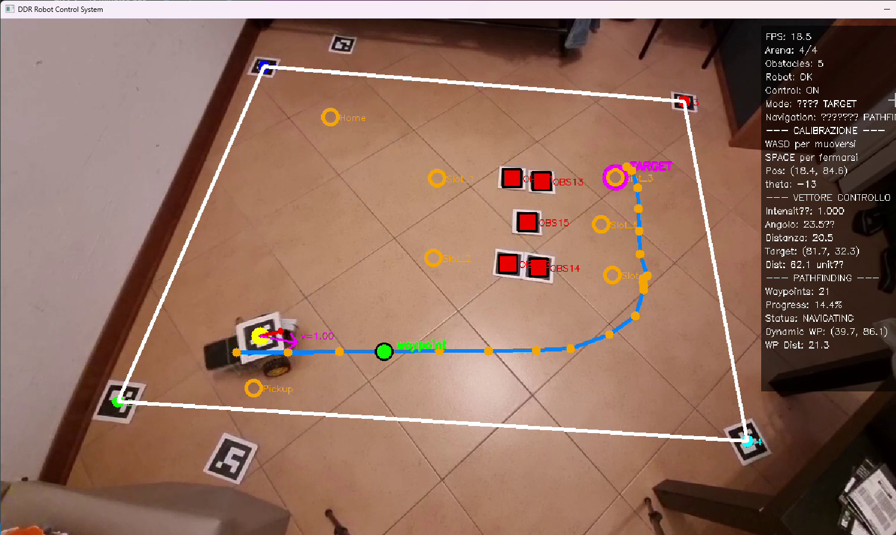

# Differential Drive Robot with Remote Control

## Description
This project implements a **physical Differential Drive Robot (DDR)** integrated with the *cargoservice* system, originally developed for the course Ingengeria dei Sistemi Software at Alma Mater Studiorum - Università di Bologna.  
The goal is to replace the Virtual Robot used in development with a real robot while keeping compatibility with the existing communication model.

## Project report
The full project report (in Italian) is available [here](./userDocs/relazione.pdf).

## System architecture
The system is composed of three main software macro-components:

1. **Local control system**  
   - Runs onboard the robot (Raspberry Pi).  
   - Receives commands via WebSocket and manages motor actuation through an L298 driver.  
   - Supports basic movement commands (`forward`, `backward`, `left`, `right`, `stop`) with PWM speed control.

2. **Central control system**  
   - Coordinates and supervises the robot.  
   - Monitors position and orientation using **ArUco fiducial markers** and an overhead camera.  
   - Implements pathfinding (A* algorithm) and PID control for precise movements.

3. **QAK actor**  
   - Integration middleware with *cargoservice*.  
   - Translates high-level commands (`engage`, `moverobot`, `pickUpCargo`, …) into JSON WebSocket messages.  
   - Preserves compatibility with the protocol used by the `basicrobot` module.

## Communication
- **Transport:** WebSocket  
- **Message format:** JSON  
- **Example commands sent from client to server:**
  ```json
  { "command": "engage" }
  { "command": "disengage" }
  { "command": "movetosquare", "x": 1, "y": 2 }

* **Server replies:**

  ```json
  { "status": "success", "message": "..." }
  { "status": "error", "message": "description" }
  ```
* **Asynchronous movement-completion event:**

  ```json
  { "command": "moverobotdone", "movement_id": "id", "status": "success" }
  ```

## Hardware

* Robot chassis with two DC geared motors + caster wheel.
* Motor driver: **L298**.
* **Raspberry Pi 3B** for control and networking.
* USB powerbank to power the Raspberry Pi.
* Overhead camera for ArUco marker detection.

---

## 🏗️ System Architecture

```
┌─────────────────┐    WebSocket    ┌──────────────────┐
│   Control PC    │◄──────────────► │   Raspberry Pi   │
│                 │                 │                  │
│ ┌─────────────┐ │                 │ ┌──────────────┐ │
│ │Vision System│ │                 │ │Motor Control │ │
│ │   (ArUco)   │ │                 │ │   (L298N)    │ │
│ └─────────────┘ │                 │ └──────────────┘ │
│ ┌─────────────┐ │                 │                  │
│ │ Pathfinding │ │    Commands     │     ┌─────┐      │
│ │    (A*)     │ │ ──────────────► │     │Robot│      │
│ └─────────────┘ │                 │     └─────┘      │
│ ┌─────────────┐ │                 │                  │
│ │ PID Control │ │                 │                  │
│ └─────────────┘ │                 │                  │
│ ┌─────────────┐ │                 │                  │
│ │     UI      │ │                 │                  │
│ └─────────────┘ │                 │                  │
└─────────────────┘                 └──────────────────┘
```

## User Interface

UI screenshot:
